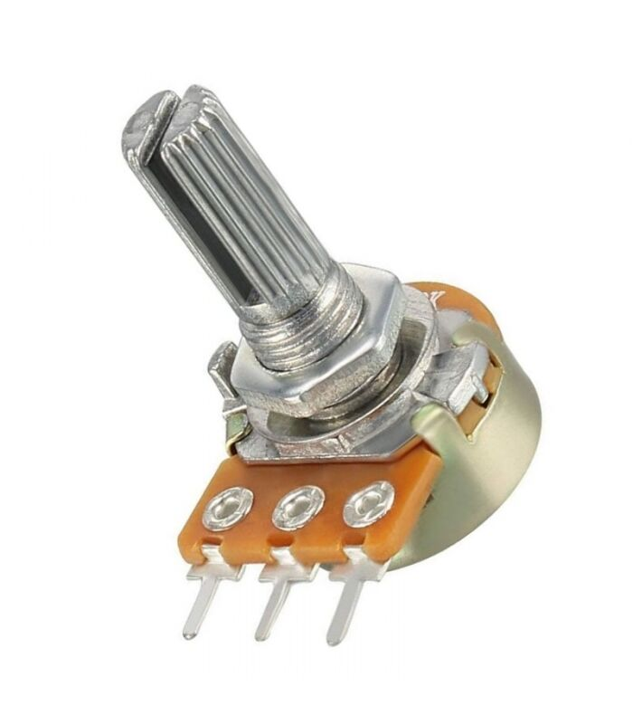

# Hareket Sensörü ile Kanal Sinyalleri Oluşturmak
Potansiyometreye ayarlı direnç dendiğinden daha önce bahsetmiştik. Bu devre elemanının;
* Üç bacağı olduğunu, 
* İlk ve son bacaklarına Arduino'nun Vcc (5V) ve GND pinlerinin bağlandığını, 
* Orta bacağının Arduino'nun analog girişlerinden bir tanesine (e.g., A0) bağlandığını, 
* Analogdan dijitale çevirici (Analog to Digital Converter - ADC) aracılığıyla [0-5V] aralığında sürekli (continuous) değer alabilen analog bir sinyalin, [0-1023] aralığında bir tam sayıya (integer) dönüştürülerek alındığını, 

görmüştük. Bir potansiyometreyi ve yukarıda listelenen Arduino bağlantılarını Şekil 1'de görebilirsiniz.

 

*Şekil 1: Potansiyometre (ayarlı direnç) ve Arduino-potansiyometre bağlantıları.*