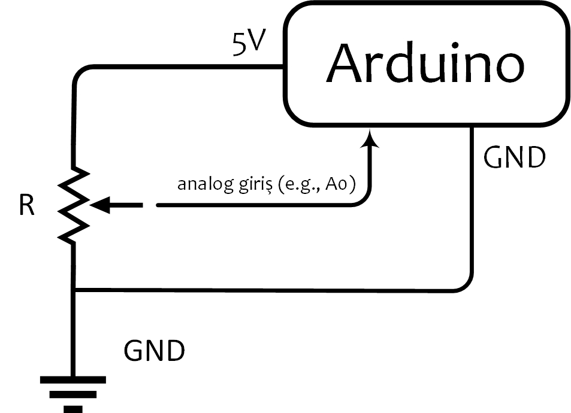

# H$\hat{a}$reket Sensörü ile Kanal Sinyalleri Oluşturmak
## Potansiyometre
Potansiyometreye ayarlı direnç dendiğinden daha önce bahsetmiştik. Bu devre elemanının;
* Üç bacağı olduğunu, 
* İlk ve son bacaklarına Arduino'nun Vcc (5V) ve GND pinlerinin bağlandığını, 
* Orta bacağının Arduino'nun analog girişlerinden bir tanesine (e.g., A0) bağlandığını, 
* Analogdan dijitale çevirici (Analog to Digital Converter - ADC) aracılığıyla [0-5V] aralığında sürekli (continuous) değer alabilen analog bir sinyalin, [0-1023] aralığında bir tam sayıya (integer) dönüştürülerek alındığını, 

görmüştük. Bir potansiyometreyi ve yukarıda listelenen Arduino bağlantılarını Şekil 1'de görebilirsiniz.

 

*Şekil 1: Potansiyometre ([1]'in izni ile) ve Arduino-potansiyometre bağlantıları.*
## Joystick
İçinde iki tane potansiyometre barındıran bir joystick'in resmini Şekil 2'de görebilirsiniz. Her bir potansiyometrenin üretmiş olduğu sinyale *kanal sinyali* diyeceğiz. Kendi-kendini dengeleyen robot projesinde manuel kontrol için **iki** kanala (ileri-geri ve kendi ekseni etrafında dönme (i.e., spin)), dron projesinde ise minimum **dört** kanala (i.e., yukarı-aşağı (i.e., *throttle*), kendi ekseni etrafında dönme (i.e., *rudder* veya *yaw*), sağa-sola (*aileron* veya *roll*) ve ileri-geri (*elevator* veya *pitch*)) ihtiyaç duyulmaktadır.

*Şekil 2: İki eksenli joystick ([2]'in izni ile). VRx ve VRy olarak isimlendirilen çıkışlar Arduino'nun analog girişlerine (e.g., A0 ve A1) bağlanmaktadır.*

Şekil 2'de gösterilen iki-kanallı joystick'in beşinci bacağı **SW** olarak isimlendirilmiş olup *switch* anlamında *anahtar* vazifesi görmektedir. Joystick'in üzerine basılmadığında **HIGH** durumunda olan bu bacak basıldığı zaman **LOW** duruma geçer ve bu sinyal Arduino'ya dijital giriş olarak alınabilir1. Bu şekilde istenildiği zaman joystick'e basarak Arduino'ya işaret gönderip kanal sinyalleri için hareket sensörüne geçeceğimizi bildirebiliriz. Burada gözden kaçırılmaması gereken bir nokta VRx ve VRy bacaklarından Arduino'ya her zaman sinyallerin okunduğudur. Eğer joystick'e basılıp da kontrol hareket sensörüne geçse bile joystick sinyallerini Arduino'ya almaya devam ediyor olacağız. Ancak robota veya drona gönderilecek olan kanal sinyalleri joystick'den gitmiyor olabilir.

## Dipnotlar
1 Kullanılan joystick'e göre **SW** girişinin default değeri değişebilir, bu yüzden multimetre veya Arduino seri port ile push-button'a basılmadığında oluşan değeri test ediniz.

## Kaynaklar
[1] https://www.direnc.net/22k-potansiyometre-potansiyometre-spike-55641-56-B.jpg 
[2] https://market.projehocam.com/wp-content/uploads/joystick.jpg 